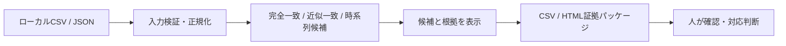

# pakulist ハッカソン発表資料

## 発表の前提

**持ち時間は4分、質疑応答は3分**である。本資料は投影用スライドの文言、話者メモ、時間配分を一体化した台本である。発表の中心は「完成品を急ぐ前に、事業・規約・データ・AI原価の不確実性を計画で潰し、その計画を検証する最小プロトタイプを作った」という判断である。

> **一文で伝える価値**: pakulistは、重複・後発類似投稿を「判定候補」として整理し、人が安全に確認・対応判断できる状態にするための、計画主導のローカル検証プロトタイプです。

## 4分の進行表

| 時刻 | スライド | 投影する主張 | 話すこと |
| --- | --- | --- | --- |
| 0:00–0:25 | 1. 課題 | 投稿の重複を見つけるだけでは対応できない | 候補、根拠、最終判断を分ける必要を説明する。 |
| 0:25–0:55 | 2. 作ったもの | ローカルで候補と証拠を整理するMVP | 完全一致・近似一致・時系列候補と出力を示す。 |
| 0:55–1:35 | 3. なぜ完成品にしなかったか | 不確実性を計画で先に固定した | データ権限、利用者価値、AI原価、保存を先取りしない判断を伝える。 |
| 1:35–2:10 | 4. 最小プロトタイプ | 仕様を検証するためだけに実装した | 入力→検出→候補・根拠→CSV/HTMLの流れをデモする。 |
| 2:10–3:20 | 5. 評価基準への対応 | 8基準を「根拠・未達・次の検証」で可視化した | 下表の8項目を一言ずつ述べ、誇張しない。 |
| 3:20–4:00 | 6. 次の一手 | 実装競争ではなく、承認と実測へ進む | 外部データ承認、利用者検証、料金設計、限定AI評価の順を示す。 |

---

## スライド1 — 課題: 「見つける」だけでは対応できない

### 投影用テキスト

> **重複・後発類似投稿を、人が確認・対応できる候補へ。**
>
> 検出結果だけでは不十分です。必要なのは、投稿URL、時刻、本文、判定根拠を揃え、最終判断を人に残すことです。

### 話者メモ（25秒）

SNS上の重複投稿や後発の類似投稿では、単に似ている投稿を検出しても対応につながりません。確認者が投稿URL、投稿時刻、本文、判定根拠を見て、規約や状況を踏まえた最終判断をする必要があります。pakulistは、その**判断前の候補整理**を対象にしました。自動通報や違反判定を目的にしていません。

---

## スライド2 — 作ったもの: ローカル検証プロトタイプ

### 投影用テキスト

| 入力 | 判定 | 人に渡す根拠 |
| --- | --- | --- |
| 正規に用意されたCSV / JSON | 完全一致・決定的な近似一致・時系列候補 | URL、時刻、本文、類似度、判定種別、CSV / HTML証拠パッケージ |

> **データはブラウザ内で処理し、外部API・サーバー保存・自動通報は行いません。**

### 話者メモ（30秒）

MVPは、利用者が正規に用意したCSVまたはJSONをブラウザで読み込み、完全一致・決定的な近似一致・起点投稿より後の候補を整理します。結果はCSVとHTMLの証拠パッケージで保存できます。重要なのは、データをサーバーに送らず、外部APIも自動通報も行わないことです。これは便利さの不足ではなく、検証段階で守るべき安全境界です。

---

## スライド3 — 意図的に「完成品」にしなかった理由

### 投影用テキスト

> **今回は完成品ではありません。計画が成果物の中心です。**

| 先に決めた不確実性 | 今回の判断 |
| --- | --- |
| 比較対象の投稿をどう正規に扱うか | 承認・権限・保持・削除の設計を先行 |
| 誰が、何に対価を払うか | 利用者検証と価格仮説を先行 |
| AIが本当に必要か、原価は成立するか | 決定的手法とAIの役割を分離し、実測を後続化 |
| 関係性グラフを保存してよいか | 論理モデルと導入ゲートだけを設計 |

### 話者メモ（40秒）

今回の成果物は完成品ではありません。むしろ、**計画を主に作り、実装は仕様とコンセプトの検証に必要なプロトタイプへ意図的に限定しました**。実データの取得権限、利用者価値、価格、LLM原価、保持・削除を確定しないまま、API連携やAI、保存を作り込むことは危険です。そこで、何を実装しないかを先に定義し、実装はその境界を確認するための最小構成にしました。

---

## スライド4 — 最小プロトタイプで検証したこと

### 投影用テキスト

| 実装で確認した境界 | 例 |
| --- | --- |
| 正確性・再現性 | 単体テスト、5,000件性能回帰、ブラウザE2E |
| 安全な出力 | CSVインジェクション対策、本文のテキスト表示、外部リンクは利用者操作 |
| 人の判断の保持 | 注意事項を含む証拠パッケージ。スクリーンショット取得・通報送信はしない。 |

### 話者メモ（35秒）

最小プロトタイプでは、入力の検証から候補の表示、証拠出力までの一連を確認しました。5,000件の性能回帰、単体テスト、ブラウザE2Eも整備しています。一方、投稿の自動取得、ログイン、保存、AI呼び出し、自動通報はありません。できることを増やすのではなく、**安全に人の判断へ渡せる最小の流れ**を実証したプロトタイプです。

---

## スライド5 — 評価基準への対応: 根拠と未達を分けた

### 投影用テキスト

| 評価基準 | 現在地 | 発表で示す根拠 | 次の検証 |
| --- | --- | --- | --- |
| 1. 課題の実在性 | 一部確定 | 重複投稿候補の課題、規約留意点、利用者検証計画 | ヒアリングで反復性・代替手段を確認 |
| 2. ビジネス成立性 | 一部確定 | OSS/有料候補の境界、価格・利用枠の検証計画 | 実利用者価値・原価・利用量を実測 |
| 3. 完成度・デモ | 一部確定 | ローカルMVP、時系列候補、CSV/HTML、回帰テスト | 許可済みデータと利用者デモ |
| 4. AIの必然性 | 設計済み | 決定的手法とAIの役割分離、評価・棄権・原価設計 | 実モデルで精度・偽陽性・原価を評価 |
| 5. 技術的な作り込み | 一部確定 | 検証、性能、E2E、安全な出力、入力アダプター | 外部連携の運用実装・実運用テスト |
| 6. LLM・外部APIコスト | 設計済み | AI/X APIの原価式、利用枠、停止・精算条件 | 契約単価と実測使用量を確認 |
| 7. セキュリティ | 一部確定 | 無保存・ブラウザ内、保持・削除・監査の設計 | 認証・権限・削除・監査を実装検証 |
| 8. 次世代性・独創性 | 設計済み | 関係性グラフの論理モデルと本文非返却API契約 | 利用者価値を確認後にグラフ試作 |

### 話者メモ（70秒）

評価一覧の8項目を、達成したと言い切るのではなく、**現在地・根拠・次の検証**で整理しました。課題の実在性とビジネス成立性は、一部確定です。利用者ヒアリングと原価実測がまだ必要です。完成度は、ローカルの検出・証拠整理・回帰テストまで確認しました。AIについては、まず決定的手法と役割を分け、精度と原価を測る評価設計までです。技術、コスト、セキュリティ、次世代性についても、実装済みの境界と後続の検証を明確にしています。ここでの誠実さが、計画主導の強みです。

---

## スライド6 — 次の一手: 実装より先に「承認」と「実測」

### 投影用テキスト

> **次の成功条件は、機能数ではありません。**

1. 正規な外部データ連携を開始できるか、承認・運用条件を確定する。
2. 利用者検証で、課題・価格・利用枠・グラフ価値を確かめる。
3. 単価と権限が揃った条件だけで、AIを限定評価する。

> **pakulistは、検出を自動化する前に、判断を安全にする計画を実装しました。**

### 話者メモ（40秒）

次に優先すべきは、新機能の追加ではありません。まず正規な外部データ連携の承認と運用条件、次に利用者検証と価格・利用枠の実測、最後に条件が揃った限定的なAI評価です。pakulistは、検出を自動化する前に、**人が安全に判断するための計画と境界を実装した**プロトタイプです。ご清聴ありがとうございました。

---

## 評価一覧との完全対応メモ

この資料は、`doc/specs/evaluation_criteria.md` の「4. 評価一覧」すべてを扱う。スライド5は要約であり、各項目の正確なステータスは次表を正とする。

| # | 評価基準 | 正確なステータス | 発表上の表現ルール |
| --- | --- | --- | --- |
| 1 | 課題の実在性 | 一部確定 | 規約留意点と検証計画はあるが、利用者ヒアリング未実施と述べる。 |
| 2 | ビジネス成立性 | 一部確定 | 二層構造と価格計画を示し、需要・原価・利用量は未実測と述べる。 |
| 3 | 完成度・デモの説得力 | 一部確定 | ローカルMVPと自動検証を示し、本番サービスではないと述べる。 |
| 4 | AIである必然性 | 設計済み | AI評価設計までであり、実モデルの精度証明ではないと述べる。 |
| 5 | 技術的な作り込み | 一部確定 | ローカルの品質・安全性を根拠にし、外部連携の運用実装は未達と述べる。 |
| 6 | LLM・外部APIコスト | 設計済み | 原価式・利用枠設計までであり、契約単価・実測は未達と述べる。 |
| 7 | セキュリティ | 一部確定 | 無保存MVPと将来設計を示し、認証・権限・監査の実運用は未達と述べる。 |
| 8 | 次世代性・独創性 | 設計済み | グラフの論理モデルと導入ゲートを示し、UI・保存サービスは未実装と述べる。 |

## 発表者チェックリスト

| 確認項目 | 発表前の確認 |
| --- | --- |
| 時間 | 話者メモを読み上げて4分以内であることを確認する。余剰があればスライド5の説明を圧縮する。 |
| デモ | 実演する場合は、架空データだけを使い、ネットワーク接続に依存しない。失敗時はスライド4の図へ切り替える。 |
| 表現 | 「検出候補」「人が最終判断」「計画主導」「最小プロトタイプ」を繰り返し、違反・侵害・人物関係を断定しない。 |
| 質疑 | `hackathon_qa_3min.md`を参照し、未達事項を隠さず次の検証として答える。 |
