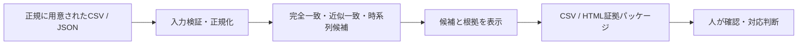

# AI HACK 2026で、SNS重複投稿を「人が判断できる候補」に変える pakulist を作った

> **Qiita投稿用メタデータ**
>
> | 項目 | 内容 |
> | --- | --- |
> | 投稿タイトル | AI HACK 2026で、SNS重複投稿を「人が判断できる候補」に変える pakulist を作った |
> | タグ候補 | `AIHACK`、`OrcaRouter`、`JavaScript`、`Node.js`、`OSS` |
> | プロジェクト | [pakulist](https://github.com/tmyymmt/pakulist) |
> | ハッカソン | [AI HACK 2026](https://aihackathon.jp/) |

## はじめに

[AI HACK 2026](https://aihackathon.jp/)に参加し、SNS上の重複投稿や後発の類似投稿を、**人が確認・対応判断できる候補と根拠へ整理する**ためのプロトタイプ、**pakulist**を開発しています。[1]

この取り組みで重視したのは、AIで「違反」や「コピー」を断定することではありません。似ている投稿を見つけても、投稿時刻、文脈、各プラットフォームの規約、利用者の目的を踏まえた最終判断は人が担うべきです。pakulistは、最終判断の前に必要な候補と根拠を、安全に揃えることを目標にしました。

本記事は、ハッカソン期間中の活動として、課題設定、最小プロトタイプ、AI連携の考え方、そして次に検証すべきことをまとめたものです。プロジェクト掲載の参考として、課題・解決策・技術・今後の展開を一続きで説明する構成を採用しました。[2]

## 解きたい課題

SNS上で同じ文面や非常に似た文面が複数アカウントから投稿されているとき、目視での比較には時間がかかります。しかし、単に「似ている投稿」をリスト化するだけでは、対応に必要な情報が不足します。

確認者には、少なくとも投稿URL、投稿時刻、本文、どの比較方法で候補になったか、起点投稿との時間差といった根拠が必要です。さらに、候補はあくまで候補であり、違反・侵害・不正行為・アカウントの関係性を自動で断定しない設計が必要です。

> **pakulistの役割は、投稿を裁くことではなく、人が確認できる状態へ整理することです。**

## 作ったもの: pakulist

[pakulist](https://github.com/tmyymmt/pakulist)は、正規に用意された投稿データをローカルで読み込み、異なるアカウント間の重複・類似候補を整理するWebアプリケーションです。[3]

| 入力 | 検出・整理 | 出力 |
| --- | --- | --- |
| CSV、JSON、保存済みのX API Search形式JSON | 完全一致、決定的な近似一致、起点投稿より後の類似候補 | 画面表示、CSV、HTML証拠パッケージ |

現行MVPでは、投稿データをブラウザ内で処理します。外部APIへの自動接続、サーバー保存、ログイン、自動通報、スクリーンショット自動取得は行いません。この制約は未完成ではなく、実データの権限・保持・削除・費用・責任分界が未確定の段階で、便利さを先行させないための設計判断です。

### 実装した主な機能

完全一致だけでなく、URLやメンションを無視するかを選べる決定的な近似一致と、指定した起点投稿・起点アカウントより後に現れた候補の時系列整理を実装しました。出力では、確認者が比較しやすいよう、候補ごとの投稿URL、本文、時刻、類似度、判定種別、時刻差を扱います。

また、CSVインジェクション対策、入力形式・日時・URL・重複ID・件数上限の検証、HTML出力時のエスケープを実装しています。検出のしきい値を調整できても、最終結論を自動化しないことが設計の中心です。



## ハッカソンで取り組んだこと

今回の活動では、機能を増やす前に、仕様と実装の差分を洗い出し、課題をGitHub Issueとして整理しました。そのうえで、優先度の高い順に、X API入力アダプター、5,000件の性能確認、ブラウザE2E、時系列コピー候補、HTML証拠パッケージ、外部データ連携のガバナンス、AI評価基盤を段階的に追加しました。

これは「完成したサービス」を急ぐよりも、後から問題になりやすい外部データの権限、料金、保存、削除、AI原価、最終判断の責任を先に設計するためです。AI HACK 2026は9日間でAIプロダクトを形にするイベントであり、技術だけでなくビジネス価値や独自性も総合的に評価されます。[1] そのため、pakulistでは、動く画面と同じくらい、**何を今は実装しないか**を明確にすることを成果物として扱いました。

### 検証の積み上げ

品質面では、検出エンジンの単体テスト、1,000件・5,000件の完全一致／近似一致を対象にした性能回帰、ブラウザE2Eを整備しました。実データなしでも再現可能な架空データを用意し、入力から候補・証拠出力までの流れを検証しています。

この構成により、外部サービスの認証情報や実投稿データを持ち込まなくても、プロトタイプの中核である「候補と根拠の整理」をデモできます。

## AIを使う場所と、使わない場所

表層的な文字列一致だけでは、語順変更や言い換えを十分に扱えません。一方で、意味的類似をAIに任せると、精度、偽陽性、棄権、原価、送信データの扱いを検証する必要があります。

そこでpakulistでは、役割を次のように分けました。

| 層 | 担当 | 現在の状態 |
| --- | --- | --- |
| OSSのローカルMVP | 完全一致、決定的近似一致、時系列候補、CSV・HTML出力 | 実装済み。外部AIを呼ばない。 |
| 評価基盤 | 架空ラベル付き評価セット、F1、偽陽性率、棄権率、原価計算 | 実装済み。外部AIを呼ばない。 |
| 将来の有料サービス | 意味的類似判定、認証、予算制御、監査、保持・削除 | 導入ゲートを満たした後に検証する。 |

この分離によって、「AIを使えば便利そう」という期待だけで実データを送信したり、料金が読めない状態で機能を有効化したりしないようにしています。

## OrcaRouterを使った最小サーバーAPIの試作

将来の意味的類似判定では、[OrcaRouter](https://www.orcarouter.ai/ja)を外部AIゲートウェイとして使う前提で、最小のサーバー側APIプロトタイプを追加しました。[4]

OrcaRouterはOpenAI互換の単一エンドポイントを提供するAIゲートウェイで、複数モデルの利用、ルーティング、可観測性、ガードレールなどを掲げています。[4] pakulistでは、現行のブラウザMVPにAPIキーやAI SDKを混在させず、将来の有料サービス側にだけ連携を閉じ込める設計を採用しています。

試作APIは既定でローカルホストにだけバインドし、`ORCAROUTER_API_KEY`と固定モデルの両方が設定された場合だけ通信します。キーまたはモデルが未設定なら、外部通信を行わず、安全に`abstain`を返します。認証失敗、利用枠不足、レート制限、上流障害、タイムアウト、構造化応答の不正が起きても、上流のエラー本文やAPIキーを利用者へ返さない方針です。

```text
ブラウザMVP / detection.js
  └─ 外部AI・APIキーに依存しない

将来のクローズドサービス
  └─ SemanticSimilarityProvider
       └─ OrcaRouter
            └─ 固定した評価モデル
```

ここで重要なのは、**AI連携そのものを有効化したわけではない**ことです。実APIキーを使う結合試験、実投稿データの送信、本番認証、保存、課金、X API取得は未実施です。これらは、資格情報、データ利用権限、料金、利用者価値、保持・削除・監査の条件がそろってから進めます。

## 技術構成

| 領域 | 採用したもの | 目的 |
| --- | --- | --- |
| フロントエンド | HTML、CSS、JavaScript | ローカルファイルをブラウザ内で処理する。 |
| 検出 | 決定的な正規化・トークン類似度・時系列比較 | 再現可能な候補抽出を行う。 |
| 実行環境 | Node.js 22、静的サーバー | ローカルで簡単に試せるようにする。 |
| 品質確認 | `node:test`、Playwright、性能ベンチマーク | 入力検証、検出、出力、ブラウザ操作、5,000件規模の回帰を確認する。 |
| 将来のAI境界 | OrcaRouter互換の最小サーバーAPI | APIキーをブラウザやOSS検出エンジンから分離する。 |

## 実際に試すには

リポジトリを取得し、Node.js 22以降で次を実行します。

```bash
cd app
npm start
```

既定では`http://localhost:4173`で起動します。`app/examples/`には架空投稿データと保存済みX API Search形式のサンプルがあるため、実データを使わずに検出と出力を確認できます。

```bash
cd app
npm run test:all
```

AIの最小サーバーAPIも起動できますが、キー未設定の標準状態では外部通信しません。

```bash
cd app
npm run start:semantic-api
curl http://127.0.0.1:4180/healthz
```

実APIの利用は、キーをリポジトリ・ブラウザ・ログへ保存せず、サーバー側のシークレット管理と導入ゲートを満たした条件でだけ検討します。

## 今後の展開

次の成功条件は、機能数を増やすことではありません。まず、正規な外部データ連携の承認・運用条件を確定し、次に利用者検証で課題・価格・利用枠を確かめます。その後、承認済みの評価データ、固定モデル、当日の単価、予算上限をそろえた条件で、意味的類似判定を限定評価します。

関係性グラフ、X APIによる投稿取得、恒久保存、認証、課金、自動通報も、必要性と権限・責任・コストが明確になったものから段階的に扱う予定です。pakulistは、検出を自動化する前に、**人の判断を安全に支える計画と最小プロトタイプを実装する**ことを選びました。

## おわりに

AIを使ったプロダクトでは、モデルを呼び出すこと自体よりも、何を入力にし、何を返し、どこで人に判断を戻すかが重要です。今回のハッカソンでは、SNS投稿の候補整理という身近な問題を題材に、ローカル処理、検証可能な決定的手法、証拠出力、外部連携の安全境界を組み合わせました。

プロジェクトのソースコード、仕様、Issue、PRはGitHubで公開しています。フィードバックや改善提案を歓迎します。

- [pakulist リポジトリ](https://github.com/tmyymmt/pakulist)
- [AI HACK 2026](https://aihackathon.jp/)
- [OrcaRouter 日本語サイト](https://www.orcarouter.ai/ja)

## 参考資料

[1]: https://aihackathon.jp/ "AI HACK 2026 公式サイト"
[2]: https://zenn.dev/hackathons/google-cloud-japan-ai-hackathon-vol4?tab=projects "第4回 Agentic AI Hackathon with Google Cloud: プロジェクト掲載"
[3]: https://github.com/tmyymmt/pakulist "pakulist GitHubリポジトリ"
[4]: https://www.orcarouter.ai/ja "OrcaRouter 日本語サイト"
