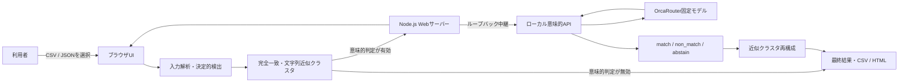

# 方式設計: ローカルWebアプリMVP

## 1. 技術選定

現行MVPはNode.js 22の標準機能とES Modulesで実装する。利用者は`npm start`でローカルWebアプリを起動する。意味的類似を利用する場合だけ、別プロセスの`npm run start:semantic-api`を起動し、利用者が一時的な環境変数で固定モデルとOrcaRouter APIキーを渡す。実行時の追加依存は持たない。

| 領域 | 採用方式 | 責務と制約 |
| --- | --- | --- |
| 実行環境 | Node.js 22以降 | `node:test`を含む標準機能を使う。 |
| Web配信・中継 | Node.jsの`http` | 静的ファイルを配信し、意味的APIへのループバック中継だけを行う。投稿ファイルは受信しない。 |
| UI | HTML/CSS/JavaScript | 入力データの読込、決定的検出、表示、出力、任意の意味的判定の要求を行う。 |
| 決定的判定 | 純粋なJavaScript関数 | 入力検証、正規化、完全一致、Jaccard近似、CSV生成を行う。 |
| 意味的再構成 | 純粋なJavaScript関数 | 候補選定、LLM結果による近似一致の追加・除外、再採番を行う。 |
| 意味的API | ローカルHTTP API + OrcaRouterアダプター | 最小化した候補本文だけを固定モデルへ送り、構造化判定を返す。 |
| テスト | `node:test` / Playwright Chromium | ロジック・出力を標準テスト、画面とモックHTTPをE2Eで確認する。 |

## 2. モジュール境界

```text
app/
├── server.js                           # 静的配信とローカル意味的API中継
├── semantic-api-server.js              # 127.0.0.1限定の意味的判定API
├── public/
│   ├── index.html                      # 画面構造・送信範囲の注意
│   ├── styles.css                      # 表示
│   └── app.js                          # ファイル読込、UI、API要求、出力
├── src/
│   ├── detection.js                    # 決定的検出・CSV生成（副作用なし）
│   ├── semantic-cluster-reconciliation.js # 候補選定・最終近似クラスタ再構成（副作用なし）
│   ├── evidence.js                     # HTML証拠パッケージ生成（副作用なし）
│   ├── semantic-evaluation.js          # 評価・原価計算（副作用なし）
│   └── orcarouter-semantic-provider.js # OrcaRouter要求・応答のアダプター
├── examples/                           # 架空の投稿・意味的再構成テストデータ
├── test/                               # 単体・契約テスト
└── e2e/                                # Playwright E2E
```

`detection.js`と`semantic-cluster-reconciliation.js`はDOM、ネットワーク、ストレージ、資格情報に依存しない。`app.js`は決定的な基準クラスタを作り、意味的判定が有効なときだけ候補を中継APIへ送る。`semantic-api-server.js`と`orcarouter-semantic-provider.js`だけがOrcaRouterの認証・HTTP通信を扱う。APIキーはクライアントへ返さない。

## 3. 処理フロー



完全一致クラスタはローカルだけで確定し、意味的候補から除外する。文字列近似クラスタ内の異アカウント投稿ペアを優先し、次に完全一致以外の投稿を時系列順に並べた隣接異アカウントペアを発見候補に加える。最大50組を同時3件まで評価する。`match`は候補を最終近似クラスタへ追加し、`non_match`は文字列近似候補を除外する。未確認、棄権、利用不可の文字列近似候補は維持する。

## 4. セキュリティ設計

`server.js`は`127.0.0.1`を既定の待受先とし、意味的中継をループバック接続以外から拒否する。中継の要求本文は32KB以下、上流待機は12秒までとする。`semantic-api-server.js`は既定で`127.0.0.1:4180`だけにバインドし、任意の`SEMANTIC_API_BEARER_TOKEN`を要求できる。

投稿ファイルはブラウザ内で読み込み、Webサーバーへアップロードしない。意味的判定を有効にしたときだけ、選定された候補ペアの本文がローカルAPIを介してOrcaRouterへ送信される。キー、モデル設定、入力ファイル、応答本文をリポジトリ、ブラウザ、CSV/JSON、ログ、Issue、PRへ保存しない。HTML出力は入力値をエスケープし、外部リソースを許可しないCSPを付与する。

## 5. 拡張方針

SNSごとの取得手段は`PostProvider`概念で画面・判定エンジンから分離する。認証、保存、課金、利用枠、承認済みX API取得を含む管理型AI機能は、OSSのローカル試作とは別の有料サービスとして実装する。時系列隣接の発見候補は全組合せを避けるための限定的な方法であり、広範囲の意味的検索が必要になった場合は評価済みの埋め込み検索又は専用候補生成機構を別途導入する。
