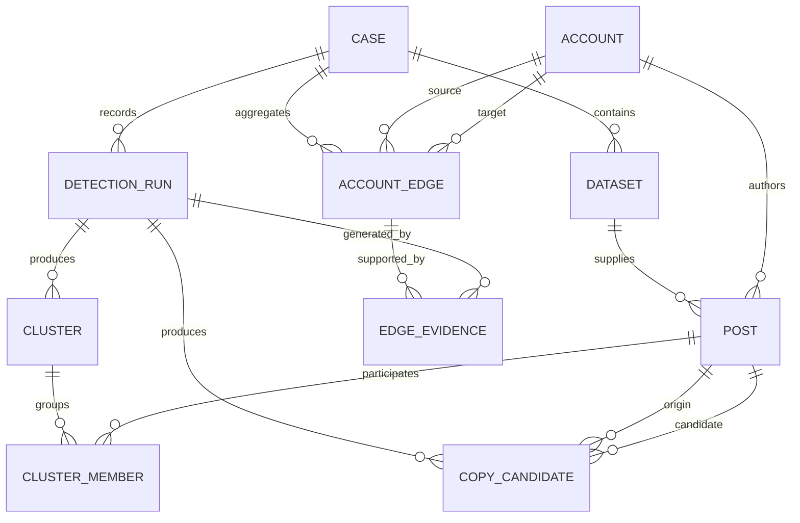

# 関係性グラフの論理データモデルと保持境界

## 1. 目的と適用範囲

本設計は、将来の関係性可視化に必要なアカウント、投稿、検出実行、クラスタ、時系列コピー候補、エッジ根拠を定義する。対象は**論理モデルとAPI契約**であり、現行OSS MVPのブラウザ内・無保存処理にデータベース、認証、外部取得、グラフUIを追加するものではない。

> 現行MVPでは、利用者が選択したローカルファイルをブラウザ内でだけ処理し、投稿本文・アカウント・URLをサーバーへ送信または保存しない。この原則を維持する。

将来のサーバー実装は、`external_data_governance.md`に定める取得承認、保持、削除、再配布、アクセス制御、監査の各ゲートを通過してから開始する。本文を含むX Contentの保存・出力可否は、データソース、利用者の権限、Xとの契約および適用法令を個別に確認する。

## 2. 設計原則

| 原則 | 設計上の適用 |
| --- | --- |
| 最小化 | グラフの描画・フィルタ・再現に必要な最小属性だけを保持する。DM、保護投稿、不要なプロフィール属性、位置情報、秘密情報はモデルに含めない。 |
| 出所分離 | `local_user_supplied`と将来の`x_api`を`sourceKind`で区別し、保持・再配布・表示の制約を混同しない。 |
| 根拠追跡 | エッジは検出実行、比較方式、類似度、時刻差、根拠投稿IDに必ず結び付ける。 |
| 再現性 | 正規化・閾値・URL/メンション除外・入力集合識別子・エンジン版を`detectionRun`へ固定する。 |
| 削除可能性 | 投稿・アカウント・導出データを事案単位で追跡し、削除対象からエッジ・インデックス・エクスポートを連鎖削除できる。 |
| 表示最小化 | 一覧・グラフAPIの既定応答には本文を含めず、本文表示はデータソースと権限が確認できる場合だけに限定する。 |

## 3. 概念モデル



関係性グラフのノードは`account`、エッジは`accountEdge`とする。`cluster`および`copyCandidate`は検出結果、`edgeEvidence`はエッジを再計算・監査するための導出根拠である。エッジ単独で「連携」「不正」「侵害」等を示さず、決定的な一致・類似や時刻順に基づく観測結果だけを表す。

## 4. 論理スキーマ

### 4.1 事案・入力集合・投稿

| エンティティ | 必須属性 | 用途・制約 |
| --- | --- | --- |
| `case` | `caseId`, `purposeCode`, `createdAt`, `sourceKind` | 分析事案の境界。目的コードなしの継続監視は認めない。 |
| `dataset` | `datasetId`, `caseId`, `sourceKind`, `sourceDescriptor`, `collectedAt`, `contentExpiresAt` | 入力集合の出所・範囲・収集条件を表す。`sourceDescriptor`は検索条件のハッシュまたはローカル投入の識別子であり、秘密情報を含めない。 |
| `account` | `accountId`, `provider`, `providerAccountId`, `handle`, `sourceKind` | SNS依存のIDと表示用ハンドルを分離する。外部API由来の表示可否はデータソースの制約に従う。 |
| `post` | `postId`, `datasetId`, `accountId`, `providerPostId`, `postedAt`, `canonicalUrl`, `contentState` | 本文は`contentText`として任意属性に分離する。削除・保護化・利用不能を`contentState`で反映し、表示対象から除外できるようにする。 |

`sourceKind`は`local_user_supplied`または`x_api`のいずれかとする。現行MVPが出力するローカル入力は`local_user_supplied`のみであり、サーバーには保存しない。将来`x_api`を扱う場合、`dataset`は取得対象、期間、エンドポイント、目的コードを記録し、保持上限と削除条件を設定する。

### 4.2 検出結果とグラフ根拠

| エンティティ | 必須属性 | 用途・制約 |
| --- | --- | --- |
| `detectionRun` | `runId`, `caseId`, `datasetIds`, `engineVersion`, `normalization`, `threshold`, `startedAt`, `finishedAt` | 同じ入力・設定で結果を再現するための実行記録。本文をログ化しない。 |
| `cluster` | `clusterId`, `runId`, `matchType`, `maxSimilarity`, `memberCount`, `accountCount` | 多アカウントの重複クラスタ。本文は保持しない。 |
| `clusterMember` | `clusterId`, `postId`, `role` | クラスタと投稿の関係。`role`は`member`を初期値とする。 |
| `copyCandidate` | `candidateId`, `runId`, `originPostId`, `candidatePostId`, `matchType`, `similarity`, `timeDifferenceSeconds` | 起点より後の候補のみを表す。時刻差は正数でなければならない。 |
| `accountEdge` | `edgeId`, `caseId`, `sourceAccountId`, `targetAccountId`, `edgeType`, `weight`, `evidenceCount`, `firstObservedAt`, `lastObservedAt` | 表示・フィルタ用の集約エッジ。自己ループは禁止し、アカウント組を`sourceAccountId`・`targetAccountId`の辞書順で正規化する。 |
| `edgeEvidence` | `edgeEvidenceId`, `edgeId`, `runId`, `evidenceType`, `sourcePostId`, `targetPostId`, `similarity`, `timeDifferenceSeconds`, `observedAt` | エッジの根拠。根拠投稿が削除対象なら同時に削除する。 |

`edgeType`は初期段階では`duplicate_text`、`approximate_text`、`later_copy_candidate`だけを許容する。`weight`は同一の`edgeType`で集計された根拠件数または合成指標であり、人物関係や違反可能性のスコアではない。

## 5. 保持・削除・エクスポートの境界

| 区分 | 保持場所と期間 | 削除・出力の扱い |
| --- | --- | --- |
| ブラウザ一時データ | 現行MVPのメモリのみ。タブの破棄または再読込まで。 | サーバー・ブラウザストレージへ保存しない。利用者の明示ダウンロードだけが端末上に残る。 |
| 利用者が明示保存したローカル出力 | 利用者の端末。現行MVPは保持期間を制御しない。 | CSV/HTMLにはデータソースを表示し、利用者が保存・削除・再配布の責任を負う。 |
| 将来のAPI取得X Content | サーバー側で最大30日。事案終了、削除要求、削除・保護化・利用不能化のうち最も早い時点で短縮する。 | 投稿・アカウント・URL・本文を含む派生物、検索インデックス、キャッシュ、エクスポート一時ファイルを連鎖削除する。 |
| 将来の導出データ | 最大90日。対応するContent削除後は本文・アカウント・URLを含まない品質集計だけを許容する。 | `edgeEvidence`、`accountEdge`、クラスタ集約を再計算または削除する。 |
| 操作・監査ログ | 最大90日。本文・URL・アカウント・トークンを含めない。 | 削除要求や事案削除に応じて、照合可能な最小ログだけを残す。 |

将来のサーバー実装では、`post`削除を起点に`clusterMember`、`copyCandidate`、`edgeEvidence`を削除し、影響を受けた`cluster`と`accountEdge`を再集計する。削除要求の受付、本人確認、期限、完了通知はアプリ外の運用手順とする。

## 6. 再現性と集計・フィルタ契約

### 6.1 再現性に必要な記録

`detectionRun`は次の値を固定する。

| 項目 | 記録方法 |
| --- | --- |
| 入力集合 | `datasetIds`と、各データセットの出所・範囲識別子 |
| 判定設定 | 近似一致の有無、閾値、URL/メンション除外、起点指定 |
| 方式 | `engineVersion`、正規化方式、比較方式、トークン化方式 |
| 時間 | 実行開始・終了、各根拠の観測時刻、時刻差 |
| 結果 | クラスタ・コピー候補・エッジ根拠のIDと集計値 |

再現要求では、対象Contentの表示・取得可否を先に確認する。元Contentが削除・保護化・保持期限切れの場合、過去結果の存在は説明できても本文を復元・表示してはならない。

### 6.2 グラフ集計API契約

将来の認証済みサーバー側APIは、本文を返さない次の応答を最小契約とする。リクエストは`caseId`、`edgeTypes`、`minEvidenceCount`、`from`、`to`、`limit`を受け、事案外のデータを返さない。

```json
{
  "schemaVersion": "1.0",
  "caseId": "case_01",
  "generatedAt": "2026-08-12T00:00:00Z",
  "filters": {
    "edgeTypes": ["duplicate_text", "later_copy_candidate"],
    "minEvidenceCount": 2,
    "from": "2026-08-01T00:00:00Z",
    "to": "2026-08-12T00:00:00Z"
  },
  "nodes": [
    { "accountId": "acct_a", "handle": "alpha", "observedPostCount": 12 }
  ],
  "edges": [
    {
      "edgeId": "edge_01",
      "sourceAccountId": "acct_a",
      "targetAccountId": "acct_b",
      "edgeType": "later_copy_candidate",
      "weight": 3,
      "evidenceCount": 3,
      "firstObservedAt": "2026-08-10T00:00:00Z",
      "lastObservedAt": "2026-08-11T00:00:00Z"
    }
  ],
  "page": { "nextCursor": null }
}
```

この契約はグラフ描画、エッジ種別、期間、根拠件数での絞り込みを可能にする。詳細な投稿本文・URLの参照は別エンドポイントとし、データソースの再配布条件、利用者権限、削除状態を検証した後にだけ返す。

## 7. 実装移行のゲート

| ゲート | 必須条件 |
| --- | --- |
| G1: 現行MVP | 無保存・ブラウザ内処理を維持する。グラフモデルは文書と契約例のみ。 |
| G2: API取得準備 | Xとの利用目的・取得方法・保持・再配布の承認、削除運用、予算・レート制限、責任者を確定する。 |
| G3: 保存サービス | 認証、事案単位の権限分離、暗号化、削除連鎖、監査、保持期限ジョブ、テストを実装する。 |
| G4: グラフ表示 | 範囲指定・期間・根拠種別・最小件数フィルタ、削除済みContentの非表示、根拠への遷移を実装する。 |

G2以降へ進む前に、最新のX Developer Policy・Agreement・利用契約、適用される個人情報保護法制、専門家レビューを確認する。これは技術設計であり、法的助言ではない。
