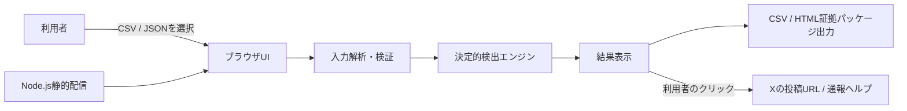

# 概要設計: ローカルWebアプリMVP

## 1. 設計方針

初期MVPは、外部サービスに依存しないローカルWebアプリとして構成する。Node.jsは静的ファイルの配信だけを担当し、投稿データのUTF-8読込、解析、検証、正規化、検出、CSV・HTML証拠パッケージ出力はすべてブラウザで実行する。この構成により、利用者が読み込んだ投稿本文・アカウント情報・投稿URLをサーバーへ保存または送信しない。

## 2. 構成

| コンポーネント | 配置 | 主な責務 |
| --- | --- | --- |
| 静的配信サーバー | `app/server.js` | ローカルHTTPサーバー、最低限のMIME・パス安全性制御、ヘルス確認。 |
| UI | `app/public/` | UTF-8のファイル選択、設定、エラー、結果、CSV・HTML証拠パッケージ出力、外部リンクの明示。 |
| 判定エンジン | `app/src/detection.js` | 入力検証、正規化、完全一致、近似一致、時系列候補、クラスタ化、CSV生成。 |
| 証拠出力 | `app/src/evidence.js` | HTMLエスケープ、CSP、注意事項を含むHTML証拠パッケージ生成。 |
| テスト | `app/test/`、`app/e2e/` | ロジック・出力をNode.js標準テストで、画面操作・入力エラーをPlaywrightで確認。 |
| サンプル | `app/examples/` | 利用者がローカルで動作を確認できる、架空の投稿データ。 |

## 3. 処理フロー

1. 利用者がUTF-8のCSVまたはJSONを選択する。
2. ブラウザでUTF-8としての読込、形式、必須項目を検証し、問題があれば理由と行番号又は配列番号を表示する。
3. 利用者が近似一致の有効化、閾値、URL・メンションの無視を設定し、必要ならUC-03の起点投稿又は起点アカウントを指定する。
4. 検出エンジンが正規化、完全一致、近似一致、クラスタ化又は時系列候補抽出を実行する。
5. 異なる2アカウント以上が含まれるクラスタ、又は起点より後の候補を証拠情報とともに表示する。
6. 利用者が必要に応じてCSV又はHTML証拠パッケージを端末へ保存し、投稿URL又は通報ヘルプを自ら開く。

## 4. 拡張方針

将来のSNSごとのデータ取得は、画面や判定エンジンから分離した`PostProvider`インターフェースを追加して実現する。X APIを接続する場合でも、認証情報はローカル環境変数や安全なサーバー側保管を使い、UIへ露出させない。AI判定はOSS判定エンジンの外側に有料サービスとして実装し、OrcaRouter経由でのみ呼び出す。

## 5. 設計上の制約

| 制約 | 対応 |
| --- | --- |
| 自動通報は禁止 | 外部リンクを示すだけとし、送信・フォーム操作・自動遷移を行わない。 |
| 取得規約を守る | 本MVPは取得を行わず、正規取得済みのローカルファイルだけを処理する。 |
| AI機能はOSS外 | AI/LLM依存を置かず、決定的な規則ベース判定に限定する。 |
| 個人情報・投稿内容の保護 | サーバー側のアップロード、DB、解析ログを持たず、ブラウザ内処理に限定する。 |
