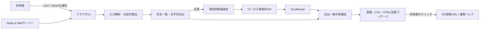

# 概要設計: ローカルWebアプリMVP

## 1. 設計方針

MVPは、利用者が正規に取得した投稿ファイルをブラウザで読み込み、決定的な重複検出と証拠出力をローカルで実行する。完全一致とJaccard類似度による近似一致は常にブラウザ内で処理する。

意味的類似は任意のローカル試作である。利用者が画面で明示的に有効化し、別途ローカル意味的APIを固定モデルと一時的なOrcaRouter APIキーで起動した場合だけ、選定された候補ペアの本文を判定する。認証、保存、課金、X API取得、自動通報は実装しない。

## 2. 構成

| コンポーネント | 配置 | 主な責務 |
| --- | --- | --- |
| Webサーバー | `app/server.js` | 静的資産配信、ループバック限定の意味的API中継。 |
| UI | `app/public/` | UTF-8ファイル選択、設定、結果、CSV・HTML出力、意味的API要求。 |
| 決定的エンジン | `app/src/detection.js` | 入力検証、正規化、完全一致、Jaccard近似、時系列候補、CSV生成。 |
| 意味的再構成 | `app/src/semantic-cluster-reconciliation.js` | 候補作成、LLM結果による近似一致の追加・除外、クラスタ再採番。 |
| 意味的API | `app/semantic-api-server.js` | localhost限定でOrcaRouterへの最小化した候補要求を仲介。 |
| 証拠出力 | `app/src/evidence.js` | HTMLエスケープ、CSP、意味的確認集計を含む証拠パッケージ。 |
| テスト・サンプル | `app/test/`、`app/e2e/`、`app/examples/` | 架空データを使うロジック、画面、再構成の回帰確認。 |

## 3. 処理フロー

1. 利用者がUTF-8のCSVまたはJSONを選択する。
2. ブラウザが形式、必須項目、件数を検証し、決定的な完全一致と近似一致を作る。
3. 意味的類似が無効なら、決定的クラスタを最終結果として表示・出力する。
4. 有効なら、完全一致を除き、文字列近似候補を優先して選び、時系列で隣接する異アカウント投稿を発見候補として補う。
5. 最大50候補を同時3件までローカルAPI経由で判定し、`match`を追加、`non_match`を文字列近似候補から除外する。
6. 最終クラスタと意味的確認集計を表示し、利用者が必要に応じてCSV又はHTML証拠パッケージを端末へ保存する。

## 4. 設計上の制約

| 制約 | 対応 |
| --- | --- |
| 自動通報は禁止 | 外部リンクを示すだけとし、送信・フォーム操作・自動遷移を行わない。 |
| 取得規約を守る | 本MVPは投稿取得を行わず、正規取得済みのローカルファイルだけを扱う。 |
| 完全一致の外部送信禁止 | 完全一致クラスタの投稿を意味的候補から除外する。 |
| 意味的判定の送信範囲 | 有効化時だけ、文字列近似候補と時系列隣接の発見候補本文を送る。 |
| 秘密情報の保護 | APIキーは一時的なサーバープロセス環境変数だけで扱い、ブラウザ・ファイル・ログ・リポジトリへ保存しない。 |
| 意味的検索の範囲 | 全組合せではなく時系列隣接候補に限定する。広範囲検索は後続の評価対象とする。 |
